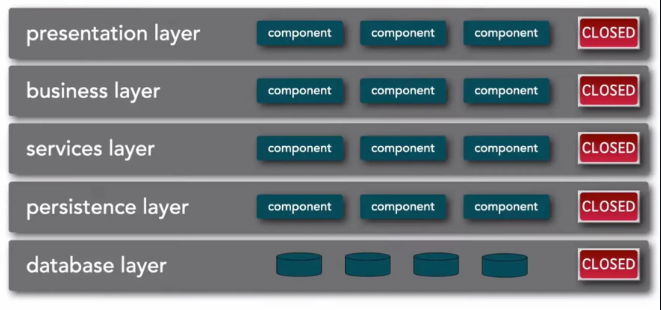
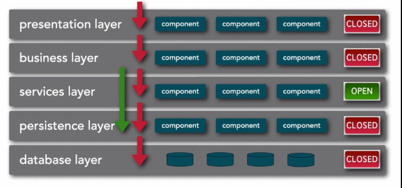
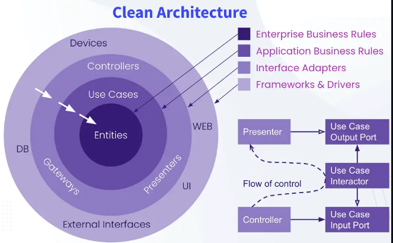

# Q&A
## Q1
What are the characteristics of monolithic architectures, and what are their main advantages and disadvantages? 
## A1 
Le architetture monolitiche sono un approccio per lo sviluppo di software che prevede la presenza di un'unica unità. In questa architettura tutti i componenti, come UI, logica di business e le operazioni su DB, sono strettamente integrate in un'unica codebase ed eseguono come un singolo processo.
### Vantaggi
I vantaggi delle architetture monolitiche si presentano principalmente in applicazioni di piccole dimensioni, e sono:
- **Avere a disposizione una grande collezione di strumenti**: Gli IDE e debugger sono ottimizzati per lo sviluppo di singole applicazioni.
- **Testing immediato**: I test end-to-end possono essere scritti direttamente per lanciare l'applicazione, invocare le API e testare la UI con strumenti come Selenium.
- **Deployment semplice**: Gli sviluppatori posssono semplicemente copiare il file WAR su un server con Tomcat. In più possono cambiare il codice e lo schema del DB, per poi eseguire il build e deployare in maniera semplicissima.
- **Performance**: La comunicazione tra componenti e velocissima, siccome tutto è all'interno del singolo processo.
### Svantaggi
Cosa succede però se l'applicazione diventa più grande? Siccome i componenti sono tra loro **strettamente accoppiati** andiamo verso un degrado strutturale (**big ball of mud**, il picco della **complessità locale**). In questo ambito, una modifica in una parte del codice implica la modifica di tutto il sistema, portando a:
- **Sviluppo lento**: Il ciclo "edit-build-run-test" rallenta all'aumentare delle dimensioni dell'applicazione, in quanto aumenterà il tempo di startup della stessa.
- **Challenge di testing**: Se in applicazioni di piccole dimensioni il testing era molto semplice, le grandi dimensioni rendono il testing molto più complesso, il che porta a un bug fixing molto complesso (che può portare alla mancata scoperta degli stessi).
- **Path di deployment lunghissimo**: La produzione di aggiornamenti può diventare un incubo, portando alla presenza di massimo un update al mese, rendendo la Continuous Deployment impraticabile.
- **Stack tecnologico obsoleto**: La struttura monolitica rende difficile l'adozione di frameworks e linguaggi aggiornati (ex. se ho pezzi di codice di una libreria sparsi per i componenti, devo cambiare ogni singolo componente). Per farlo dovrei riscrivere l'intera applicazione (**costosissimo**).

## Q2
Explain the *layered architecture* pattern and its key advantages and disadvantages.
## A2
La *layered architecture* (o *multi-layered architecture*) è uno stile architetturale monolitico che prevede la divisione di un applicazione in più strati (*layer*) seguendo una separazione **tecnica**.  
Ogni *layer* ha le sue responsabilità:
- **Presentation**: gestisce la UI.
- **Business**: gestisce le business logic.
- **Servizi**: fornisce le funzionalità.
- **Persistenza**: gestisce la persistenza dei dati sottostanti
- **Database**  
  
Ogni *layer*, come comportamento di default comunica con il *layer* sottostante. Possiamo però cambiare questo comportamento, difatti ogni strato può essere:
- **Chiuso**: Forza il comportamento di default, il *layer* N+1 dovrà comunicare solo con il *layer* N.
- **Aperto**: Il *layer* potrà essere bypassato. Ad esempio  
  
in questo caso il *business layer* potrà comunicare con quello di persistenza, "saltando" quello dei servizi.
### Vantaggi
- Si separano perfettamente i problemi, possiamo infatti pensare a UI, dati e business logic separatamente
- È facile dividere il team per permettergli di lavorare su componenti diversi contemporaneamente
- Siccome è un'architettura *well-understood* in ambiti aziendali, è facile trovare sviluppatori *skilled* per progetti che fanno uso di *layered architecture*.
### Svantaggi
- I messaggi tra layer possono portare a grandi overhead.
- Il refactoring del codice può essere complesso in caso di cambiamenti legati al **dominio** di un certo componente (Ex. Sistema di pagamento, piuttosto che cambiamenti alla UI), che possono portare a cambiamenti contemporanei di tutti i *layer*.
### Quando usarla
Per applicazioni semplici e per team pre-esistenti e team separati dal punto di vista tecnico. Oltre che per applicazioni in cui i cambiamenti tecnici (Ex. UI e DB) sono più frequenti
### Valutazioni
| **Feature**      | **Score** |
|------------------|-----------|
| cost             | * * * * * |
| simplicity       | * * * * * |
| maintainability  | *         |
| evolvability     | *         |
| scalability      | *         |

## Q3
What is the *clean architecture*, and how does it improve the *layered architecture*? 
## A3
La *clean architecture* ([Descritta con precisione a questo link](https://blog.cleancoder.com/uncle-bob/2012/08/13/the-clean-architecture.html)) è un approccio architetturale monolitico pensato per rendere i sistemi più manutenibili, flessibili e testabili. Enfatizza una separazione dei problemi organizzando il software in layer distinti dove i layer interni sono indipendenti da quelli esterni. In questo modo creiamo componenti indipendenti e riusabili, con regole precise su come i componenti devono interagire tra loro.  
  
### Vantaggi
- La *clean architecture* promuove un alto disaccoppiamento tra i componenti, assicurando che i cambiamenti dei layer esterni non influenzino quelli interni.  
- Aumenta la testabilità del sistema, peremettendo agli sviluppatori di testare i componenti indipendentemente.
- Grazie alla sua natura modulare, è più facile rimpiazzare/aggiornare parti del sistema senza impattare sulla business logic.
### Svantaggi
- Ha una curva di apprendimento molto ripida se si vuole arrivare a capire i principi dell'architettura i modo profondo.
- L'overhead di creazione dei diversi livelli di astrazione può rallentare le fasi iniziali dello sviluppo.
### Quando usarla
- Se si lavora con sistemi che devono evolvere nel tempo, dove diversi team sono responsabili di diversi compoenenti.
- È particolarmente utile quando c'è un altro livello di business logic che deve rimanere isolata da dipendenze esterne coem UI e Database.
### Valutazioni
| **Feature**      | **Score** |
|------------------|-----------|
| cost             | * * * * * |
| simplicity       | * * *     |
| maintainability  | * *       |
| evolvability     | * *       |
| scalability      | *         |

## Q4
Describe the concept of a modular monolith and its benefits over other monolithic architectures.
## A4
Il monolite modulare è un approccio architetturale monolitico che predilige una separazione dell'applicazione sulla base delle **funzionalità di business**, dunque che sia determinata sulle richieste di business più che dai limiti tecnici (come avveniva nella *layered architecture*).  
L'architettura divide la logica applicativa in moduli ognuno dei quali al loro interno ha una propria business logic e la propria base di dati. Ogni modulo, inoltre, può essere un potenziale **microservizio** se deployato in maniere indipendente ([Strangler pattern](https://microservices.io/patterns/refactoring/strangler-application.html)).  
Utilizzare un monolite modulare piuttosto che un monolite classico permette l'**incapsulamento della business logic** in moduli, abilitando alta riusabilità mentre i dati rimangono consistenti e i pattern di comunicazione semplici. I moduli possono dunque essere **riusati**, in modo da aiutare i team a stabilire un'unica fonte di verità.  
Nonostante questi vantaggi bisogna ricordare che il monolite modulare è diverso dai microservizi, i moduli dovranno utilizzare gli stessi stack tecnologici e linguaggi e non potranno scalare ed essere deployati indipendentemente, in quanto parliamo ancora di un'applicazione in singolo blocco. 
### Quando usarla
Quando i cambiamenti dell'applicazione e la divisione del team riguardano principalmente i domini dei moduli (praticamente l'opposto della *layered*).  
Può essere utile in fase di **modernizzazione**: piuttosto che partire subito con un'architettura a microservizi si può passare per il monolite modulare finché le dimensioni dell'applicazione rimangono contenute, potendo godere dei vantaggi iniziali dell'approccio monolitico.   
Infine, è l'approccio migliore per tutte quelle applicazioni che non sono adatte all'architettura distribuita, tipo tutte quelle applicazioni che necessitano di una **consistenza forte** nei dati.
### Valutazione
| **Feature**      | **Score** |
|------------------|-----------|
| cost             | * * * * * |
| simplicity       | * * * * * |
| maintainability  | * *       |
| evolvability     | * *       |
| scalability      | *         |

## Q5 
Explain the **database per service pattern** in microservices architecture. What are the benefits and challenges of this approach?
## A5

Il **database per service pattern** è un approccio architetturale utilizzato nelle architetture a microservizi, in cui ogni microservizio ha la propria base di dati. Questo pattern promuove l'idea che ogni microservizio sia autonomo e indipendente, permettendo così una maggiore flessibilità e scalabilità.
### Vantaggi
- **Indipendenza**: Ogni microservizio può scegliere il tipo di database più adatto alle proprie esigenze, senza dover dipendere da un database condiviso.
- **Scalabilità**: I microservizi possono essere scalati in modo indipendente, permettendo una gestione più efficiente delle risorse.
- **Fault Isolation**: Se un microservizio ha problemi con il proprio database, gli altri microservizi non ne saranno influenzati, migliorando la resilienza dell'intero sistema.
### Svantaggi
- **Consistenza dei Dati**: Mantenere la consistenza dei dati tra diversi microservizi può essere complesso, specialmente in scenari di transazioni distribuite.
- **Overhead di Gestione**: Ogni microservizio richiede la propria gestione del database, aumentando la complessità operativa.
- **Difficoltà di Query Complesse**: Eseguire query che coinvolgono dati da più microservizi può essere complicato e richiedere soluzioni come API Gateway o CQRS (Command Query Responsibility Segregation).

## Q6
What challenges arise when transitioning from a monolithic architecture to microservices? How does the *Strangler Pattern* relates to these challenges?
## A6

La transizione da un'architettura monolitica a microservizi presenta diverse sfide significative:
- **Complessità di Decomposizione**: Identificare i confini dei microservizi può essere difficile. È necessario comprendere le dipendenze tra i vari componenti del monolite e come questi possano essere separati in servizi autonomi.
- **Gestione dei Dati**: Passare da un database monolitico a database per microservizio richiede una pianificazione attenta per evitare problemi di consistenza e integrità dei dati.
- **Comunicazione tra Servizi**: La comunicazione tra microservizi richiede l'implementazione di protocolli di rete, che possono introdurre latenza e complessità.
- **Cultura e Competenze**: I team di sviluppo potrebbero dover acquisire nuove competenze e adattare la loro cultura di lavoro per gestire un'architettura distribuita.

Lo **strangler pattern** è una strategia utile per affrontare queste sfide. Consiste nel creare nuovi microservizi che gradualmente sostituiscono le funzionalità del monolite, permettendo una transizione graduale e riducendo il rischio di interruzioni. In questo modo, le nuove funzionalità possono essere sviluppate come microservizi, mentre le vecchie funzionalità rimangono nel monolite fino a quando non vengono sostituite. Questo approccio consente di mantenere il sistema funzionante durante la transizione e facilita l'adozione dei microservizi senza dover riscrivere l'intera applicazione in una volta sola.

## Q7
Describe advantages and drawbacks of *service-based* and *service-oriented* architectures. Which of the two is the natural evolution in the distributed context of the *modular monolith architecture*?
## A7

* **Service-based architecture**:
    * Ogni applicazione è composta da un insieme di servizi autonomi che comunicano tra loro tramite API.
    * Questa architettura si concentra sulla separazione dei servizi in base alle business capabilities, consentendo una maggiore flessibilità e scalabilità.
    * **Vantaggi**:
        * Maggiore indipendenza dei servizi, che possono essere sviluppati, testati,  distribuiti e scalati in modo autonomo.
        * Basso costo, nessun bisogno di automazione operazionale (come in DevOps).
        * Il database singolo permette semplicità e forte consistenza.
        * Modernizzazione del monolite modulare.
    * **Svantaggi**:
        * La comunicazione tra i servizi può introdurre latenza e complessità.
        * Il debugging e il monitoraggio possono diventare più complessi a causa della natura distribuita dell'architettura.
        * Big ball of distributed mud in caso di servizi altamente accoppiati.
        * Bassa elasticità, il Mean Time To Start per servizi a grana meno fine (es. un servizio per gestire diversi domini) è molto alto.
    * Quando usarla:
        * Progetti da medie a grandi dimensioni, dove diversi team sono responsabili di diverse funzioni di business.
        * Ideale quando le applicazioni devono scalare parti del sistema in modo indipendente basandosi sulla domanda degli utenti e i requisiti di performance.

* **Service-oriented architecture (SOA)**:
    * Paradigma di design dove i componenti software forniscono funzionalità attraverso interfacce e protocolli standardizzati.
    * Nei SOA, i servizi sono progettati per essere riutilizzabili e self-contained, e possono essere discovered e invocati da altri servizi o applicazioni mediante protocolli di comunicazione standard come SOAP o REST. 
    * Questi servizi interagiscono tra loro per formare processi di business completi, promuovendo loose coupling e modularità.
    * **Vantaggi**:
        * Interoperabilità e integrazione tra sistemi eterogenei.
        * Aumentano la flessibilità, siccome i servizi possono essere composti per formare processi di business senza dover riscrivere l'intero sistema.
        * Disaccoppiando i servizi tra loro, supporta l'integrazione attraverso piattaforme e tecnologie eterogenee, rendendolo ideale per ambienti aziendali con sistemi diversi.
    * **Svantaggi**:
        * Abilità limitata di rispondere rapidamente ai cambiamenti.
        * Performance overhead dovuto al comportamnrto agnostico dal protocollo di comunicazione. 
        * Funzionalità conmdivise diventano dei single point of failure, e la loro modifica può impattare su più servizi.
    * Quando usarla:
        * Sistemi enterprise complessi che richiedono integrazione tra applicazioni e piattaforme eterogenee.
        * Quando abbiamo processi di business che si muovono tra diversi sistemi o quando dobbiamo esporre funzionalità a partner esterni o applicazioni di terze parti. 

L'evoluzione naturale in un contesto distribuito della **modular monolith architecture** è la **service-based architecture**. 
Poiché:
* La SBA consente di estrarre gradualmente i moduli del monolite in servizi distribuiti, mantenendo una struttura simile.
* Permette una migrazione incrementale: si può iniziare con la separazione dei moduli più autonomi senza stravolgere l’architettura.
* Riduce il rischio rispetto a una SOA completa, che richiede fin da subito un'infrastruttura più pesante e complessa.

## Q8
Explain the role and challenges of communications in microservices architecture.
## A8
La comunicazione è un aspetto cruciale nell'architettura a microservizi, poiché i microservizi sono progettati per essere autonomi e indipendenti, ma devono comunque collaborare per fornire funzionalità complete. Le comunicazioni tra microservizi possono avvenire in diversi modi, ognuno con i propri vantaggi e svantaggi.

**Pattern di comunicazione**:
- **Synchronous**: I microservizi comunicano tra loro in tempo reale, utilizzando protocolli come HTTP/REST o gRPC. Questo approccio è semplice e diretto, ma può introdurre latenza e dipendenze tra i servizi.
- **Asynchronous**: I microservizi comunicano tramite messaggi, utilizzando code o sistemi di messaggistica come RabbitMQ o Kafka. Questo approccio consente una maggiore resilienza e scalabilità, ma richiede una gestione più complessa dei messaggi e delle code.

**Challenges**:
- **Latency**: La comunicazione tra microservizi può introdurre latenza, specialmente se si utilizzano chiamate sincrone. È importante progettare le comunicazioni in modo da minimizzare i tempi di risposta.
- **Fault Tolerance**: I microservizi devono essere in grado di gestire i fallimenti delle comunicazioni, ad esempio implementando meccanismi di retry o circuit breaker per evitare che un servizio non disponibile blocchi l'intero sistema.
- **Data Consistency**: Mantenere la consistenza dei dati tra microservizi può essere complesso, specialmente in scenari di transazioni distribuite. È necessario implementare strategie come il pattern Saga o l'event sourcing per gestire le modifiche ai dati in modo coerente.
- **Monitoring e Debugging**: Tracciare le comunicazioni tra microservizi può essere difficile, specialmente in sistemi complessi. È importante implementare strumenti di monitoraggio e logging per identificare e risolvere i problemi di comunicazione.

## Q9
Discuss the key features and challenges of the *microservices architecture*.
## A9

**Key Features**:
- **Autonomia**: O Separazione dei concerns. Ogni microservizio è un'unità indipendente che può essere sviluppata, distribuita e scalata autonomamente.
- **Comunicazione dei servizi** attraverso protocolli leggerti, spesso HTTP/REST o code di messaggi.
- **Rapida risposta ai cambiamenti**: I microservizi possono essere aggiornati e distribuiti in modo indipendente, consentendo una maggiore agilità nello sviluppo.
- **Chassis comune** per uno sviluppo semplificato (chasssis pattern).
- **Evita il lock-in tecnologico**: Ogni microservizio può utilizzare tecnologie diverse, consentendo una maggiore flessibilità.
- **Scalabilità**: I microservizi possono essere scalati in modo indipendente, consentendo una gestione più efficiente delle risorse.
- **Fault Isolation**: Se un microservizio fallisce, gli altri possono continuare a funzionare, migliorando la resilienza del sistema.

**Challenges**:
- **Gestione della comunicazione**: La comunicazione tra microservizi può introdurre latenza e complessità, specialmente quando il numero di servizi cresce.
- **Il debugging e il monitoraggio** attraverso servizi distribuiti richiedono tools e tecniche specializzati.
- **Operational overhead** siccome ogni microservizio ha il suo database, stack tecnologico e requisiti di deployment.

**Quando usarla**:
- Quando si ha un'applicazione complessa che richiede una rapida e indipendente evoluzione e scalabilità.
- Quando si ha un team di sviluppo con avanzate conoscenze dei sistemi distribuiti e l'abilità di gestire le complessità della comunicazione e del monitoraggio.

## Q10
What is the microservice *chassis pattern*, and how does it help in simplifying cross-cutting concerns in microservices architecture?

## A10

Il **Microservice Chassis Pattern** è un approccio architetturale che fornisce un **framework riutilizzabile** per gestire i **cross-cutting concerns** comuni a tutti i microservizi.

**Esempi di cross-cutting concerns**:
- Discovery dei servizi
- Gestione della configurazione
- Logging e monitoraggio
- Autenticazione e autorizzazione
- Tracciamento e metriche
- Circuit breaker e retry
- Gestione degli errori

**Vantaggi del Chassis**

| Vantaggio                        | Descrizione                                                                      |
|----------------------------------|----------------------------------------------------------------------------------|
| **Standardizzazione**           | Tutti i servizi seguono pratiche comuni                                         |
| **Riutilizzo del codice**       | Evita la duplicazione delle logiche condivise                                   |
| **Sviluppo più rapido**         | I team si concentrano sul business, non sull'infrastruttura                     |
| **Manutenzione semplificata**   | Un cambiamento nel chassis può propagarsi a tutti i servizi                     |
| **Best practices integrate**    | Impone policy e strumenti coerenti tra microservizi                             |

**Possibili Svantaggi**

- **Accoppiamento eccessivo** con il chassis
- **Problemi di versionamento** tra servizi
- **Crescita eccessiva del chassis** (troppe funzionalità inutilizzate)

Il **Microservice Chassis Pattern** aiuta a **semplificare lo sviluppo** dei microservizi fornendo una base comune per gestire le funzioni infrastrutturali. È particolarmente utile in ambienti distribuiti su larga scala dove è importante mantenere **coerenza, velocità e qualità**.

## Q11
Describe the concept of *scale cube* and its three dimensions.
# A11
Lo **scale-cube** è un modello concettuale per descrivere come scalare un'applicazione distribuita. Prevede tre dimensioni principali di scalabilità:
- **X-Axis Scaling (Horizontal Scaling)**: Aggiunta di più istanze dello stesso servizio per gestire un carico maggiore. 
Può essere costoso in termini di hardware, tutti i nodi devono essere in grado di gestire esigenze di picco. Può essere lento, soprattutto se abbiamo un artifact molto grande, siccome dobbiamo avviarlo e aggiornare il DNS, richiedendo anche diversi secondi.
- **Z-Axis Scaling (Data Partitioning)**: Ogni istanza è responsabile di un subset dei dati, permettendo un uso efficiente delle risorse. Possiamo però avere dei problemi legati alla gestione dei dati, scalabilità limitata (andiamo a scalare solo i dati e non le funzionalità) e operational overhead (dobbiamo gestire la partizione dei dati e le query che li attraversano).
- **Y-Axis Scaling (Functional Decomposition)**: Suddivisione dell'applicazione in servizi più piccoli e autonomi, ognuno responsabile di una specifica funzionalità o dominio. Questo approccio consente di scalare le funzionalità in modo indipendente.
Ogni servizio può essere poi scalato usando la X-Axis o la Z-Axis scaling.