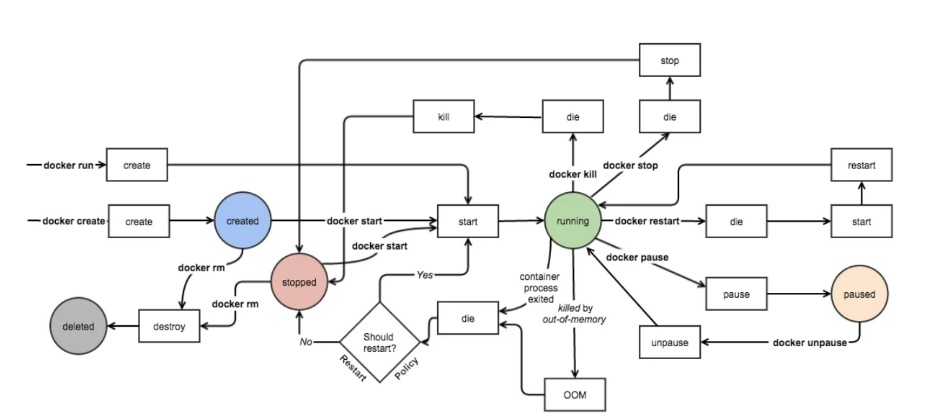

### 1. Quali sono le principali differenze tra bare-metal, macchine virtuali e deployment basati su container? Spiega il concetto di **densità di deployment**.

La **densità di deployment** indica quanti ambienti eseguibili (VM o container) possono convivere su un host.

**Una alta densità del deployment** significa che ci sono più carichi di lavoro che girano su meno risorse, spesso portando a una migliore utilizzo dell’infrastruttura disponibile, ma può anche presentare sfide relative alla contendibilità delle risorse, alle prestazioni e alla scalabilità.

🧱 **Distribuzione Bare-Metal (nessun isolamento, bassa densità)**

Nel modello bare-metal, le applicazioni vengono **eseguite direttamente su server fisici**, spesso condividendo lo stesso sistema operativo e risorse hardware (CPU, RAM, disco).

- ✅ **Pro**:
    - Nessun overhead di virtualizzazione
    - Massime prestazioni
- ❌ **Contro**:
    - Nessun isolamento → conflitti tra applicazioni (librerie, porte, versioni di runtime)
    - **Scarsa scalabilità**: un errore in un'app può influenzare tutte le altre
    - **Risorse sprecate**: spesso un server veniva dedicato a una sola app per evitare conflitti, con conseguente sottoutilizzo dell’hardware
    - **Manutenzione complessa**: difficile aggiornare, migrare o replicare ambienti

🔍 **Bassa densità di deployment** → ogni applicazione occupa un intero server o condivide male le risorse, quindi **pochi deployment per host**.

💻 **Distribuzione Virtualizzata (isolamento, densità media)**

Con l’introduzione dell’**hypervisor** (es. VMware ESXi, KVM), è possibile eseguire più **macchine virtuali** su un singolo host fisico. Ogni VM contiene:

- il proprio sistema operativo
- il proprio stack applicativo

Questo approccio isola le applicazioni e ne permette il deployment in modo più flessibile.

✅ **Pro**: 

- **Isolamento forte** tra VM
- Possibilità di usare OS diversi
- **Scalabilità migliorata** rispetto al bare-metal
- Miglior uso dell’hardware
- ❌ **Contro**:
    - Ogni VM esegue un intero sistema operativo → **alto overhead**
    - Avvio lento
    - Occupano più spazio su disco e più RAM

📊 **Densità di deployment media** → si possono eseguire diverse VM per host, ma il numero resta limitato dal carico generato da ogni sistema operativo completo.

### 📦 **Distribuzione Containerizzata (isolamento leggero, alta densità)**

I **container** sono entità isolate che **condividono il kernel dell’host**, ma funzionano come processi indipendenti, impacchettando tutto ciò che serve all’applicazione (librerie, configurazioni, binari).

A differenza delle VM:

- non contengono un sistema operativo completo
- sono molto più **leggeri e veloci da avviare**
- sono altamente **portabili**

✅ **Pro**:

- **Isolamento efficiente** a basso costo
- Avvio istantaneo
- Elevata **densità** e utilizzo ottimale dell’hardware
- Ideali per ambienti **cloud-native** e microservizi
- Migliore supporto alla **portabilità** tra ambienti (dev → test → prod)

❌ **Contro**:

- Condividono il kernel dell’host → meno adatti a workload eterogenei o legacy
- Richiedono gestione attenta della sicurezza (namespace, capabilities)

📈 **Alta densità di deployment** → decine o centinaia di container possono convivere su un solo host fisico grazie alla leggerezza e condivisione del kernel.

### 2. Cos’è un **Docker registry** e in che modo facilita la distribuzione e la gestione delle **immagini dei container**?

Un registro Docker è un servizio  per memorizzare e distribuire immagini Docker.
Funziona come un repository dove gli utenti possono pubblicare, prelevare e gestire immagini Docker. Registri
pubblici come Docker Hub sono disponibili e gli utenti possono anche impostare registri privati per uso interno
all’interno delle organizzazioni.

Le funzioni principali svolte da un registry sono

- Archiviazione e gestione delle immagini
- Versionamento tramite tag (`:latest`, `:1.2.0`)
- Accesso controllato con autenticazione/ruoli
- Supporto al caching e al content delivery (CDN)

### 🎯 **Perché è fondamentale**

- Automatizza la **distribuzione delle applicazioni containerizzate**.
- È parte integrante delle pipeline **CI/CD**:
    1. Build 
    2. Push su registry 
    3. Deploy in produzione (Kubernetes, Docker Swarm).
- Garantisce che ogni ambiente usi **immagini coerenti e versionate**.
- Centralizza e **semplifica la gestione** delle immagini in team distribuiti.

### 3. Descrivi il **ciclo di vita di un container**, dalla creazione alla terminazione.



Il ciclo di vita di un container Docker segue fasi precise: **creazione → esecuzione → terminazione → rimozione**.

| Comando | Funzione |
| --- | --- |
| `docker create` | Crea un container senza eseguirlo |
| `docker run` | Crea e avvia un container |
| `docker start` | Avvia un container già creato |
| `docker stop` | Arresta un container in modo controllato |
| `docker kill` | Termina immediatamente |
| `docker rm` | Elimina un container |
| `docker ps -a` | Elenca tutti i container (anche terminati) |
| `docker logs` | Mostra i log di esecuzione |
- **Creazione** (`docker create`): Il container viene istanziato ma **non eseguito**.
- **Avvio** (`docker start` o `docker run`): Il container entra in stato `running` ed esegue il processo principale.
- **Esecuzione:** Il container **lavora come processo isolato**, svolgendo il suo compito (es. web server, job).
- **Stop** (`docker stop`): Viene inviato un segnale **SIGTERM** per chiusura controllata.
- **Kill** (`docker kill`):  **Terminazione forzata** con SIGKILL.
- **Terminato (exited):** Il container si ferma ma resta **presente nel sistema**.
- **Rimozione** (`docker rm`) Il container viene **eliminato** dal sistema Docker.
    

**Note utili:**

- I container sono **temporanei**: se non si usano volumi, i dati interni si perdono.
- I comandi `docker run --rm` eliminano automaticamente il container alla fine.
- In produzione, il ciclo è spesso **gestito da Kubernetes o strumenti CI/CD**.

### 4. **Commenta un Dockerfile (dato)** ed **illustra le direttive principali**.

Un **Dockerfile** è un file di testo che definisce **le istruzioni per costruire un'immagine Docker**. Ogni direttiva rappresenta un passo del processo di **build**. Il Dockerfile descrive **l’ambiente, le dipendenze, i comandi di configurazione** e il processo di avvio di un container.

```docker
# Indica l'immagine di base da cui partire (livello base del container)
FROM node:18-alpine

# Imposta la directory di lavoro nel container
WORKDIR /app

# Copia il file package.json (dipendenze) nella cartella di lavoro
COPY package.json .

# Installa le dipendenze Node.js definite nel package.json
RUN npm install

# Copia tutto il contenuto locale nella directory di lavoro del container
COPY . .

# Espone la porta su cui l'app sarà in ascolto (solo a scopo informativo)
EXPOSE 3000

# Comando predefinito che verrà eseguito quando il container parte
CMD ["npm", "start"]
```

## 5. Cosa sono **Jib** e **Buildpacks**? Perché è preferibile avere immagini **più leggere**?

[Jib](https://github.com/GoogleContainerTools/jib) è uno strumento Java open-source mantenuto da Google per costruire immagini Docker di applicazioni Java. Semplifica la containerizzazione: **non dobbiamo scrivere un Dockerfile.**

Google pubblica Jib sia come plugin Maven che come plugin Gradle. Questo ci fa risparmiare comandi di build/push Docker separati e semplifica l’aggiunta a una pipeline CI.

```xml
<build>
	<plugins>
		<plugin>
			<groupId>com.google.cloud.tools</groupId>
			<artifactId>jib-maven-plugin</artifactId>
			<version>3.4.3</version>
		</plugin>
	</plugins>
</build>
```

Con questa modifica, possiamo creare immagini con:

```bash
$ mvn compile jib:build # (invia al DockerHub)
$ mvn compile jib:dockerBuild # (invia al demone Docker locale)
```

---

**Buildpacks**

è una tecnologia che **automatizza la creazione di immagini container senza scrivere un dockerfile**. 

- Analizza il progetto → rileva il linguaggio (es. Java, Node, Python)
- Installa automaticamente le dipendenze
- Costruisce un’immagine container eseguibile

La dimensione dell’immagine può avere un impatto significativo sulle prestazioni sia come sviluppatore che come organizzazione. Soprattutto quando si lavora in grandi progetti con molti servizi, questo potrebbe costare molto denaro e tempo.

- Spazio:  stai sprecando spazio su disco nel  registro  Docker e nei tuoi server di produzione.
- Larghezza di banda:  più grande è l’immagine, maggiore  è il consumo di larghezza di banda quando si estrae e si invia l’immagine da e verso il registro.
- Velocità:  più grande è l’immagine, più lungo è il  tempo necessario per costruire e inviare l’immagine.
- Sicurezza: più grande è l’immagine, maggiori sono le dipendenze e maggiore è la superficie di attacco.

**Jib** e **Buildpacks** sono strumenti moderni che semplificano e automatizzano la creazione di immagini Docker, eliminando la necessità di scrivere un Dockerfile. Entrambi producono **immagini più leggere, sicure e ottimizzate** , seguendo le **best practice del cloud-native**.

### 6. Spiega il ruolo dello **storage esternalizzato** nei container Docker e in quali modi può essere implementato.

I **volumi esterni** nei container Docker sono fondamentali per garantire la **persistenza dei dati** oltre il ciclo di vita del container stesso. Poiché i container sono progettati per essere effimeri, senza storage esterno tutti i dati creati o modificati all'interno del container vengono persi alla sua terminazione o ricreazione.

I volumi esterni  permettono quindi di:

- **Conservare dati persistenti** (come log, database, file di configurazione),
- **Condividere dati** tra più container,
- **Facilitare backup e restore** dei dati,
- **Supportare flussi di lavoro di sviluppo e produzione** con dati stabili.

Può essere implementato tramite *named volume, anonymous volume o bind mount*:

1. **Named Volume (Volume nominato)**
    - Volume definito e gestito da Docker, associato a un nome.
    - È persistente e indipendente dai container: esiste anche se i container sono rimossi.
    - Accessibile tramite comandi Docker (es. `docker volume ls`).
    - Sicuro, perché gestito internamente da Docker.
    - Tipicamente usato per dati persistenti come database o file di log.
2. **Anonymous Volume (Volume anonimo)**
    - Docker crea automaticamente un volume senza nome.
    - Persistente solo fino alla rimozione del container: quando il container viene eliminato, il volume viene eliminato insieme a esso.
    - Non è facilmente accessibile o riutilizzabile da altri container.
    - Utile per dati temporanei o cache.
3. **Bind Mount (Montaggio bind)**
    - Monta una directory o file dal filesystem del host direttamente nel container.
    - La persistenza e l’accesso dipendono dal filesystem host.
    - Permette di condividere e sincronizzare dati in tempo reale tra host e container.
    - Utile per lo sviluppo (per esempio, modificare file direttamente sul host e vederli nel container).
    - Offre accesso completo al filesystem del host, quindi meno sicuro rispetto ai volumi Docker.

### 7. È possibile definire **limiti di CPU e memoria** per un container? Perché è utile farlo?

Sì, è possibile definire limiti di CPU e memoria per un container Docker, specialmente usando Docker Compose con la direttiva `deploy.resources.limits`. Ad esempio, si può limitare la memoria a 512MB e il numero di core CPU a 2:

```yaml
services:
  meter:
    build: .
    ports:
      - "8080:8080"
    deploy:
      resources:
        limits:
          memory: 512M    # Limite di memoria a 512MB
          cpus: '2'       # Limite di CPU a 2 core
```

*Perché è utile definire questi limiti?*

1. **Controllo delle risorse**
    
    Limitando CPU e memoria, si evita che un container consumi risorse eccessive a scapito di altri container o del sistema host. Questo è importante in ambienti di produzione dove più container convivono sulla stessa macchina.
    
2. **Stabilità e affidabilità**
    
    Imporre limiti previene crash o rallentamenti causati da container che consumano più memoria o CPU di quanto previsto, migliorando la stabilità generale.
    
3. **Isolamento delle prestazioni**
    
    Garantisce che ogni container abbia una quota definita di risorse, evitando interferenze e garantendo un comportamento più prevedibile.
    
4. **Ottimizzazione e pianificazione**
    
    Permette di pianificare meglio la capacità del sistema, distribuendo risorse in modo efficiente e prevedibile tra i vari servizi.
    
5. **Prevenzione di problemi da memoria**
    
    Come nell’esempio mostrato, se un container prova ad allocare più memoria del limite imposto, viene generato un errore di "Out of memory", prevenendo crash imprevedibili o rallentamenti causati da swap o OOM killer del sistema
    

---

### 8. **Commenta un file `docker-compose.yml` (dato)** ed **illustra le direttive principali**.

**Docker Compose è uno strumento potente che ci consente di definire e gestire applicazioni Docker multi-contenitore**. **Docker in esecuzione su un singolo nodo non fornisce funzionalità complete di orchestrazione**. È particolarmente utile quando si lavora con ecosistemi di microservizi, poiché consente il coordinamento di più contenitori. Con Compose, possiamo configurare il networking, le risorse e soddisfare anche i requisiti di scalabilità.

Il file docker-compose.yaml segue una struttura gerarchica tramite l'uso di rientranze.

- **services**: Definisce i contenitori dell'applicazione; ogni servizio rappresenta un contenitore.
    - **[nome-servizio]**: Nome del singolo servizio, la scelta è a nostra discrezione.
        - **image**: Specifica l'immagine da utilizzare per il servizio.
        - **build**: Alternativa a image, consente di costruire un'immagine da un Dockerfile.
        - **ports**: Mappa le porte dell'host sul container.
        - **volumes**: Consente di condividere dati tra contenitore e host o tra contenitori.
        - **networks**: Definisce le reti che i contenitori utilizzeranno per comunicare.
        - **depends_on: <servizio>**: Definisce le dipendenze tra i servizi (quale servizio deve essere avviato per primo).
        - **environment**: Viene utilizzato per passare variabili ambientali per configurare contenitori e applicazioni.
        - **healthcheck**: Garantisce che il servizio sia sano, specificando l'intervallo e il numero di tentativi.

### 10. Cos’è l’**orchestrazione dei container** e perché è importante nella gestione di applicazioni distribuite?

L’**orchestrazione dei container** è la gestione automatizzata del ciclo di vita delle applicazioni containerizzate distribuite su più host (macchine o nodi). Consiste nel coordinare, distribuire, scalare e monitorare i container in modo efficiente e affidabile in ambienti di produzione complessi.

**Perché è importante l’orchestrazione nella gestione di applicazioni distribuite?**

1. **Distribuzione e pianificazione automatizzate**
    
    Garantisce che i container vengano posizionati automaticamente sui nodi più adatti, ottimizzando l’uso delle risorse hardware.
    
2. **Scalabilità dinamica**
    
    Permette di aumentare o ridurre automaticamente il numero di container in base al carico o alla domanda, migliorando la reattività dell’applicazione.
    
3. **Bilanciamento del carico**
    
    Distribuisce il traffico in ingresso in modo efficiente tra i container attivi, evitando sovraccarichi e garantendo alta disponibilità.
    
4. **Auto-guarigione**
    
    Rileva automaticamente i container non funzionanti o guasti e li riavvia o riprogramma su altri nodi, assicurando continuità del servizio.
    
5. **Scoperta dei servizi e networking**
    
    Gestisce la comunicazione tra i container in modo dinamico, consentendo ai servizi di trovarsi e comunicare senza configurazioni manuali complesse.
    
6. **Sicurezza e controllo degli accessi**
    
    Consente di definire ruoli, permessi e credenziali per proteggere l’accesso alle risorse e ai container.
    

**Strumenti più diffusi per l’orchestrazione dei container:**

- **Kubernetes (K8s)**: lo standard più usato, potente e scalabile per l’orchestrazione di container.
- **Docker Swarm**: integrato in Docker, semplice da usare per cluster di piccole-medie dimensioni.
- **Apache Mesos e Marathon**: piattaforme per la gestione di risorse distribuite e orchestrazione.
- **Red Hat OpenShift**: piattaforma enterprise basata su Kubernetes con funzionalità aggiuntive per sicurezza e gestione.

### DOMANDA PLUS CHE AVEVA DETTO CHE POTEVA CHIEDERE: DOCKERFILE A DUE FASI.

Questo metodo utilizza **jlink** e la **multi-stage build di Docker** per creare un’immagine container Java molto più leggera e ottimizzata, includendo solo ciò che serve per eseguire l’applicazione.

Come funziona il processo:

***Primo stadio: costruzione di un JRE personalizzato con jlink***

- Si parte da un’immagine base con JDK completa (`eclipse-temurin:21-jdk-alpine`).
- Si usa **jlink**, uno strumento del JDK, per creare una versione **personalizzata e minimale del runtime Java (JRE)**.
- `jlink` seleziona solo i moduli Java necessari (`-add-modules ALL-MODULE-PATH`) per l’applicazione, rimuovendo debug, documentazione e header (`-strip-debug`, `-no-man-pages`, `-no-header-files`).
- Inoltre, la JRE viene compressa (`-compress=2`) per ridurre ulteriormente la dimensione.
- Il risultato è una runtime Java ridotta, salvata in `/optimized-jdk-21`.

***Secondo stadio: creazione dell’immagine finale leggera***

- Si usa una immagine **Alpine Linux**, molto piccola (circa 3MB), come base per l’immagine finale.
- Viene copiato dentro l’ambiente il JRE personalizzato dal primo stadio (`COPY --from=jre-builder`).
- Si definisce la variabile d’ambiente `JAVA_HOME` che punta al JRE personalizzato, e si aggiorna la `PATH`.
- Viene creato un utente non privilegiato per motivi di sicurezza, e l’applicazione (`.jar`) viene copiata con i permessi corretti.
- L’applicazione viene eseguita come utente non root con il comando `java -jar /application.jar`.

### Vantaggi di questo approccio:

- **Riduzione significativa della dimensione dell’immagine finale** (es. 170MB rispetto a immagini Java standard molto più grandi).
- Include solo i moduli Java strettamente necessari, eliminando tutto il superfluo.
- Migliora la sicurezza eseguendo l’app come utente non privilegiato.
- Separazione chiara tra fase di build e fase di esecuzione, facilitando la manutenzione.
- Basato su Alpine, ottimizzato per immagini Docker leggere.

---

**In sintesi:**

Si crea un’immagine Docker Java ottimizzata in due fasi: prima si costruisce un runtime Java minimale con jlink, poi si confeziona l’app in un’immagine finale Alpine che utilizza quel runtime personalizzato, ottenendo così un container più leggero, sicuro ed efficiente.
