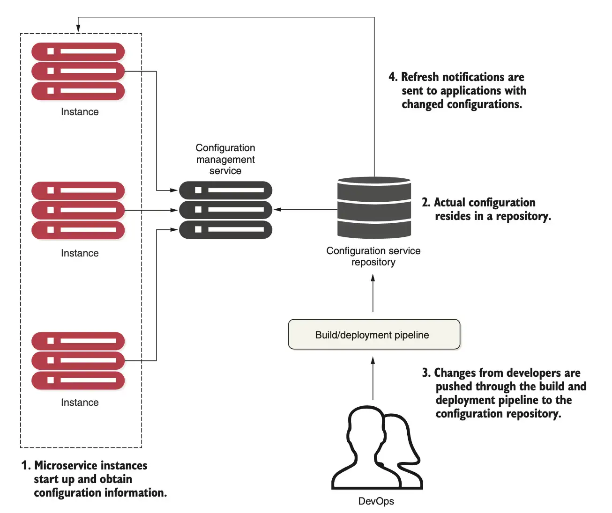

# Problem with DNS-based service discovery

## 🇬🇧

In the non-cloud world, service location resolution was often solved through a combination of a DNS and a network load balancer.
This model works well for applications with a small number of services on static servers, but it has limitations in dynamic environments like microservices. The main issues are:
- Traditional load balancers are statically managed. They require manual configuration to add or remove services, which is impractical in dynamic environments. The registration of new service instances is not done when a new service instance starts
- Centralizing your services behind a single cluster of load balancers limits your ability to scale horizontally, since all traffic must go through the load balancer. 
- The load balancer can become a single point of failure, leading to service outages if it goes down.

## 🇮🇹
Nel mondo non cloud, la risoluzione della posizione dei servizi era spesso risolta attraverso una combinazione di DNS e un load balancer di rete.
Questo modello funziona bene per applicazioni con un numero limitato di servizi su server statici, ma ha limitazioni in ambienti dinamici come i microservizi. I principali problemi sono:
- I load balancer tradizionali sono gestiti staticamente. Richiedono una configurazione manuale per aggiungere o rimuovere servizi, il che è impraticabile in ambienti dinamici. La registrazione di nuove istanze di servizio non avviene quando una nuova istanza di servizio viene avviata.
- Centralizzare i servizi dietro un singolo cluster di load balancer limita la capacità di scalare orizzontalmente, poiché tutto il traffico deve passare attraverso il load balancer.
- Il load balancer può diventare un singolo punto di fallimento, portando a interruzioni del servizio se si guasta.

# Cloud-native service discovery

## 🇬🇧
A robust service discovery mechanism ensures that services dynamically indicate their physical location instead of requiring manual DNS or load balancer configuration. To achieve this, service discovery must be:
- **Highly available**: It should be resilient to failures, ensuring that services can always find each other.
- **Peer-to-peer**: Shares service health information across nodes, often using gossip-style protocols for efficient data propagation.
- **Load-balanced**:  Distributes requests evenly across all service instances.
- **Resilient**: Caches service information locally, allowing continued operation even if the discovery service becomes unavailable.
- **Fault-tolerant**: Automatically removes unhealthy services from the registry. 

Key components are:
- **Service registration**: As instances start, they register their physical location (IP/port) for accessibility.
- **Information sharing**: Services share their health status and location with the discovery node.
- **Health monitoring**: Instances continuously update their status, and failing services are removed from the pool.

## 🇮🇹
Un meccanismo di discovery dei servizi robusto garantisce che i servizi indichino dinamicamente la loro posizione fisica, evitando la necessità di configurazioni manuali di DNS o load balancer. Per raggiungere questo obiettivo, la discovery dei servizi deve essere:
- **Altamente disponibile**: Deve essere resiliente ai guasti, garantendo che i servizi possano sempre trovarsi tra loro.
- **Peer-to-peer**: Condivide informazioni sulla salute dei servizi tra i nodi, spesso utilizzando protocolli di gossip per una propagazione efficiente dei dati.
- **Bilanciata**: Distribuisce le richieste in modo uniforme tra tutte le istanze di servizio.
- **Resiliente**: Memorizza nella cache le informazioni sui servizi localmente, consentendo il funzionamento continuo anche se il servizio di discovery diventa non disponibile.
- **Tollerante ai guasti**: Rimuove automaticamente i servizi non funzionanti dal registro.

I componenti chiave sono:
- **Registrazione del servizio**: Quando le istanze si avviano, registrano la loro posizione fisica (IP/porta) per essere accessibili.
- **Condivisione delle informazioni**: I servizi condividono il loro stato di salute e la posizione con il nodo di discovery.
- **Monitoraggio della salute**: Le istanze aggiornano continuamente il loro stato e i servizi che non funzionano vengono rimossi dal pool.

# Configuration management architecture

## 🇬🇧

1. **When a microservice instance comes up, it calls a service endpoint to read its configuration information**, which is specific to the environment it’s operating in. The connection information for the configuration management (connection credentials, service endpoint, ...) is passed into to the microservice as it starts.
2. Based on the implementation of your configuration repository, **you can choose different ways to hold your configuration data**. This can include files under source control, relational databases, key-value data stores, etc. 
3. **Changes to configuration management are typically handled through the build and deployment pipeline**, where modifications can be tagged with version information and deployed through the different environments (development, staging, production, and so forth). 
4. When the configuration management changes, the services must be notified of the alteration and refresh their copy of the application data.

## 🇮🇹

1. **Quando un'istanza di microservizio viene avviata, chiama un endpoint di servizio per leggere le informazioni di configurazione**, specifiche per l'ambiente in cui opera. Le informazioni di connessione per la gestione della configurazione (credenziali di connessione, endpoint del servizio, ...) vengono passate al microservizio all'avvio.
2. In base all'implementazione del repository di configurazione, **puoi scegliere diversi modi per memorizzare i dati di configurazione**. Questo può includere file sotto controllo di versione, database relazionali, archivi di dati chiave-valore, ecc.
3. **Le modifiche alla gestione della configurazione vengono solitamente gestite attraverso la pipeline di build e distribuzione**, dove le modifiche possono essere contrassegnate con informazioni sulla versione e distribuite attraverso i diversi ambienti (sviluppo, staging, produzione, ecc.).
4. Quando la gestione della configurazione cambia, i servizi devono essere notificati della modifica e aggiornare la loro copia dei dati dell'applicazione.
