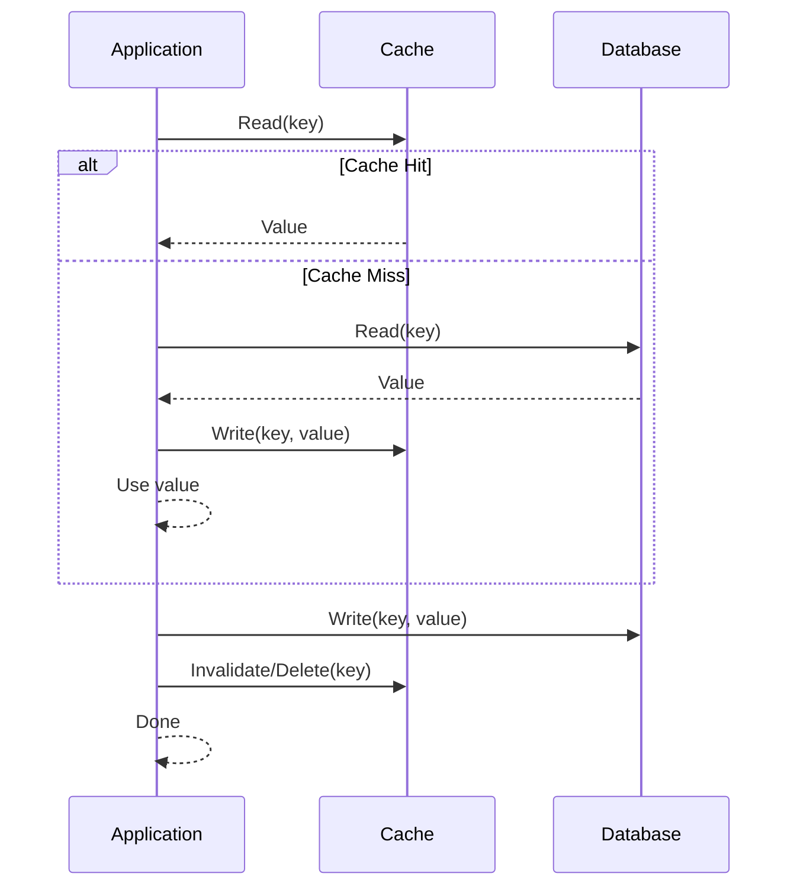
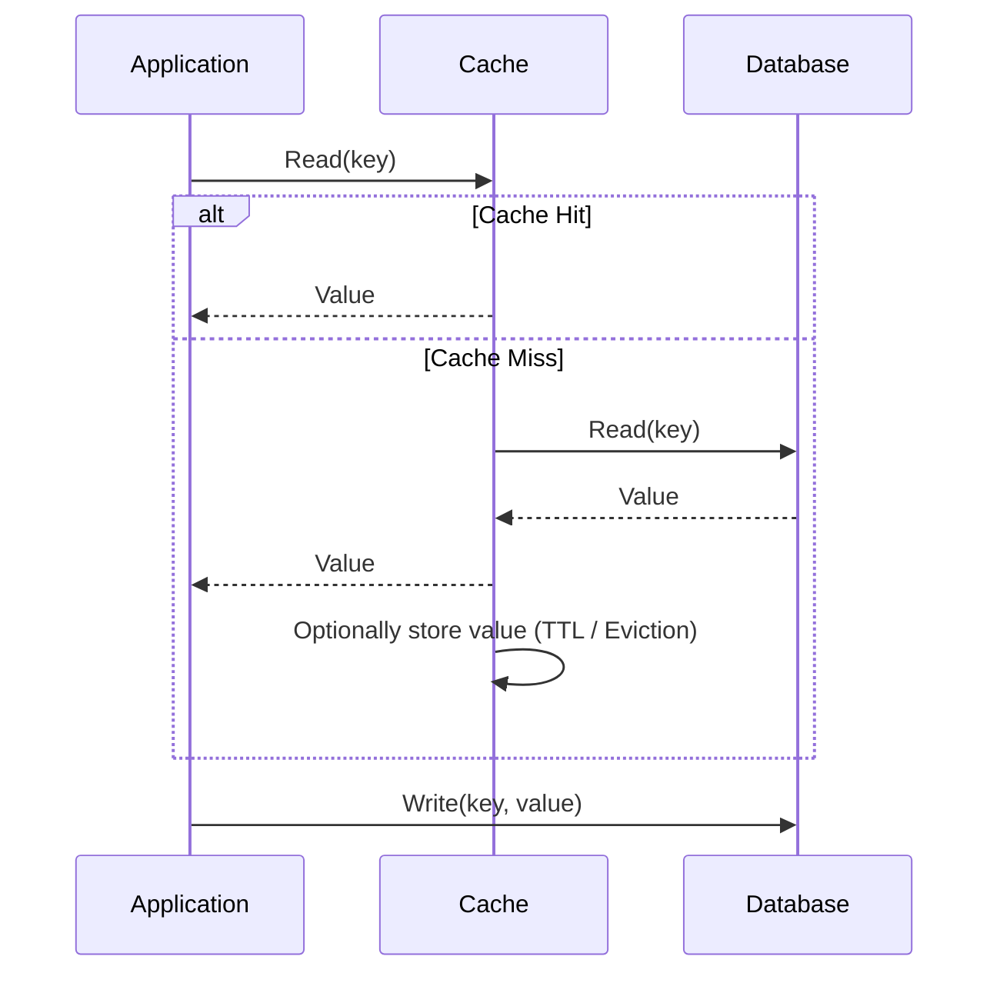
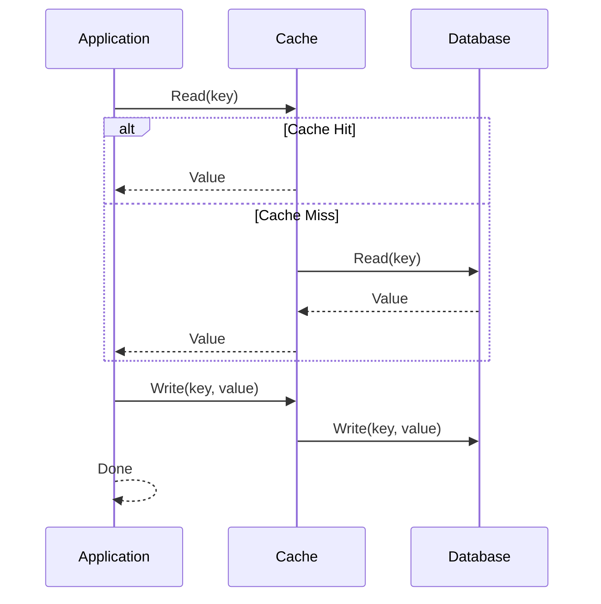
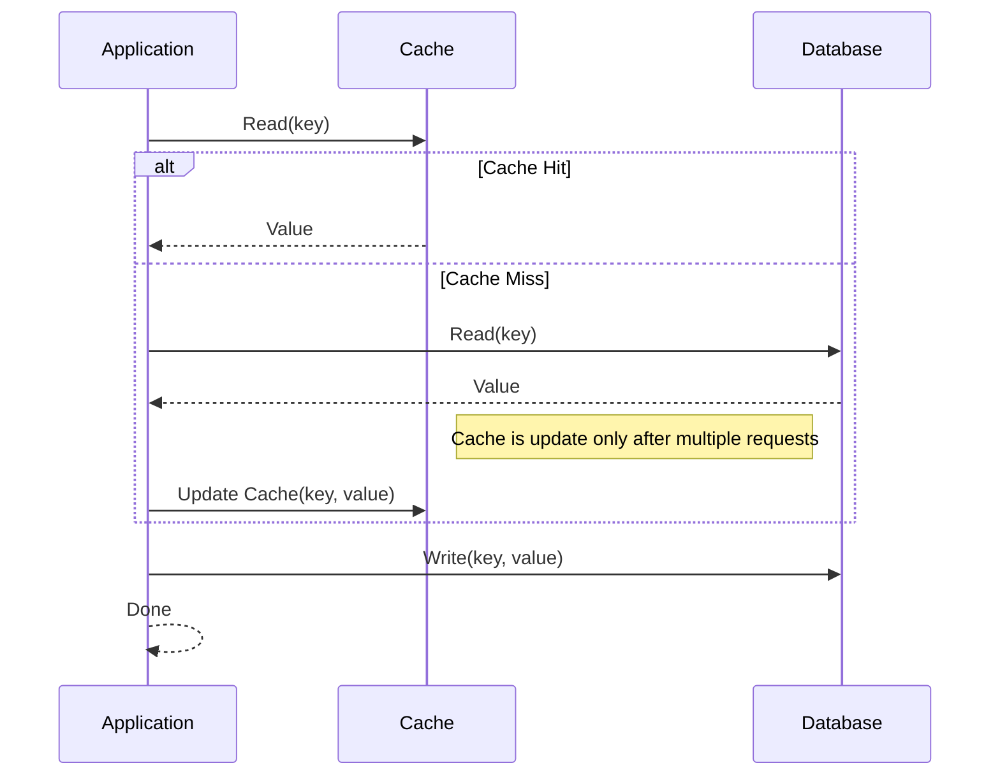

# Q&A
## Q1
What is resiliency, and why is it essential in distributed systems?
## A1
La resilienza è la capacità di un sistema distribuito di mantenere un certo funzionamento anche a fronte del fallimento di uno o più sistemi (o sottosistemi).  
La resilienza è da considerarsi essenziale per i sistemi distribuiti: oltre che garantire il funzionamnento di un sistema in condizioni complesse, creare un sistema resiliente ci permette che il failure di un microservizio non influenzi il corretto funzionamento di altri microservizi.

## Q2
Describe the one thread per request pattern and its key issues (i.e., thread pool/memory saturation).
## A2
Nel **one thread per request pattern** (pattern una richiesta-un thread) quando un servizio (Servizio A) invia una richiesta a un altro servizio (Servizio B), assegna un thread dedicato per gestire tale richiesta. Il thread è principalmente responsabile dell'attesa della risposta.  
Il problema principale è che il thread allocato rimane in uno stato di attesa, consumando semplicemente le risorse senza svolgere alcun lavoro effettivo.   
Quando il numero di richieste parallele aumenta in modo significativo, possono sorgere i seguenti problemi:

1. **Consumo di memoria**: Anche se il thread è in attesa e non utilizza le risorse della CPU, occupa comunque memoria (1 MB circa ciascuno), che aumenta con il numero di richieste simultanee.

2. **Saturazione del pool di thread**: Se molti thread attendono simultaneamente il completamento dell'I/O, il pool di thread può esaurirsi o saturarsi (numero visibile in Tomcat nella proprietà `server.tomcat.threads.max`). Quando non sono disponibili thread liberi, il sistema può mettere in coda le richieste in arrivo, con conseguente aumento dei tempi di risposta, o addirittura rifiutare del tutto le nuove richieste (DoS).

3. **Inefficienza delle risorse**: La presenza di un numero elevato di thread per lo più inattivi (in attesa di I/O) comporta un uso inefficiente delle risorse del sistema. Il sistema utilizza le risorse della CPU per gestire i thread in attesa invece di eseguire lavori utili.
## Q3
Which are the most used alternatives to the one thread per request pattern? Highlight their key features and mutual differences.
## A3
Le due possibili alternative al pattern **one thread per request** sono **Reactive Programming** e i **Java Virtual Threads**
### Reactive Programming
Invece di dedicare un thread per ogni richiesta, le applicazioni **reactive** gestiscono le richieste tramite modelli event-driven. Le operazioni che tipicamente bloccherebbero un thread (come l'attesa dell'I/O) sono gestite in modo asincrono. Quando una risposta è pronta (ad esempio, quando i dati di un database diventano disponibili), un meccanismo di callback riprende la computazione.  
Caratteristiche principali:
- **Le richieste per l'I/O non sono bloccanti**: Invece di avere un thread in attesa di operazioni di I/O (ad esempio, chiamate al database o alla rete), il sistema registra una callback per gestire l'operazione una volta terminata, liberando il thread per altre attività.
- **Uso efficiente delle risorse**: Sfruttando l'I/O non bloccante, un sistema reactive può gestire un numero maggiore di richieste simultanee con un minor numero di thread.
- **Scalabilità**: I sistemi reactive sono più scalabili perché possono gestire carichi più elevati senza un aumento significativo del consumo di risorse.

### Java Virtual Threads
Introdotti in Java 21, a differenza dei tradizionali thread del sistema operativo (pesanti e legati al sistema operativo), si utilizzano thread *fittizi* che vivono nella JVM. Quando un thread va in wait ciò che rimane in attesa è un *virtual thread*, molto leggero, mentre il thread del sistema operativo viene liberato. Quando l'operazione è terminata il thread virtuale verrà mappato su un thread del sistema operativo che eseguirà certe operazioni
## Q4
Describe the difference between client-side and server-side resiliency patterns.
## A4

I **client-side resiliency patterns** si concentrano sul proteggere un client di un servizio dal crashare quando la risorsa remota fallisce completamente o parzialmente. Questi pattern consentono al client di fallire velocemente e di non consumare risorse in attesa di una risposta che non arriverà mai.

I **server-side resiliency patterns** si concentrano sul proteggere un server da richieste che potrebbero causare il crash del server stesso. Questi pattern consentono al server di gestire le richieste in modo più efficiente, evitando di sovraccaricare il sistema e garantendo che le risorse siano disponibili per le richieste legittime.
## Q5
Describe the most used client-side resiliency patterns.
## A5

I pattern di resilienza lato client più comuni includono:

1. **Client-side load balancing**: Il client esegue un look up di tutte le istanze di un servizio da un agente di service discovery (Eureka) per poi eseguire un caching delle locazioni fisiche delle istanze dei servizi. Quando viene chiamato un servizio, il load balancer ritorna una locazione dal pool di istanze disponibili. Se il load balancer rileva un problema, può rimuovere l'istanza dal pool delle locazioni e prevenire chiamate future a tale istanza.
2. **Circuit breaker**: Il pattern del circuit breaker funziona come un meccanismo di protezione che monitora le disponibilità e la responsività di un servizio.  
Il circuit breaker mantiene uno stato basato sul rate di successo o fallimento delle richieste precedenti. Se la risposta è fallita per un certo numero di volte, il circuit breaker entra in uno stato di "aperto" e blocca le richieste al servizio per un periodo di tempo definito. Durante questo periodo, le richieste vengono fermate immediatamente senza contattare il servizio remoto. Questo permette di evitare il sovraccarico del servizio remoto e di prevenire ulteriori fallimenti. 
Key features:
- Se il circuit breaker rileva troppi fallimenti, entra in uno stato di "aperto" e blocca le richieste al servizio per un periodo di tempo definito.
- Quando il circuito è aperto, le chiamate vengoo ridireazionate a un fallback, che può essere una risposta predefinita o un'azione alternativa.
- Dopo un certo periodo, il circuit breaker può passare a uno stato di "mezza apertura" per verificare se il servizio è tornato disponibile. Se le richieste hanno successo, il circuito si chiude e le chiamate al servizio riprendono normalmente, se no, il circuito rimane aperto. Nella domanda 7 si approfondiscono le differenze tra i vari tipi di circuit breaker.
3. **Fallback processing**: Quando una chiamata a un servizio remoto fallisce, invece che generare un'eccezione, il client esegue un'azione alternativa e prova a continuare l'esecuzione mediante mezzi alternativi. Ad esempio, in un e-commerce se il sistema di consigliati non è disponibile, il client può mostrare una lista di preferenze generiche basate sugli acquisti precedenti dell'utente. 
4. **Retry**: Quando una chiamata a un servizio remoto fallisce, il pattern di retry fa partire un meccanismo di ripetizione della chiamata, che può essere configurato con un certo numero di tentativi e strategie di backoff. Bisogna tneere conto di diverse circostanze prima di applicare questo pattern:
    - **Idempotenza**: Se la chiamata è idempotente, il retry non avrà effetti collaterali indesiderati. Al contrario, se la chiamata non è idempotente, il retry potrebbe causare problemi come la creazione di risorse duplicate o l'invio di transazioni multiple.
    - **Circuit breaker**: considerare l'uso di un circuit breaker quando si abilitano i retry. Se i failure sono rari, non è un problema, ma se sono frequenti, il retry potrebbe causare un sovraccarico del servizio remoto e peggiorare la situazione. 
    - **Exponential backoff/jitter**: Implementare un meccanismo di backoff esponenziale per evitare di sovraccaricare il servizio remoto con richieste ripetute in rapida successione. Il backoff esponenziale aumenta il tempo di attesa tra i tentativi, riducendo la pressione sul servizio remoto.
    - **Operazioni time sensitive**: I retry potrebbero non essere appropriati per operazioni time-critical. Se un'operazione deve essere completata entro un certo periodo di tempo, i retry potrebbero causare ritardi indesiderati.
    
5. **Timeout**: Introduce un limite di tempo per le chiamate sincrone a un servizio remoto. Se una risposta non viene ricevuta entro il tempo specificato, la chiamata viene considerata fallita e vengono prese decisioni appropriate. Il problema principale è capire l'entità del timeout da impostare:
- Un timeout troppo breve potrebbe causare fallimenti frequenti e inutili, specialmente in situazioni di latenza elevata o carichi di lavoro pesanti.
- Un timeout troppo lungo potrebbe causare ritardi nell'elaborazione delle richieste e aumentare il rischio di sovraccarico del servizio remoto.

Una buona prassi è quella di scegliere un timeout che sia in linea alle metriche di latenza del servizio di downstream. 

6. **Bulkhead**: Pattern che prende ispirazione dalle navi, dove le stive sono divise in compartimenti per prevenire l'affondamento in caso di perdita di una stiva. In un contesto software, il bulkhead divide le risorse (come thread, connessioni o pool di database) in compartimenti separati per prevenire che un fallimento in una parte del sistema influisca su altre parti. Avendo diversi thread pool per ogni servizio, se un servizio fallisce, gli altri servizi non vengono influenzati. Questo pattern ci permette di allocare risorse in modo più efficiente e di prevenire l'esaurimento delle risorse in caso di carichi elevati.

## Q6
Describe the most used server-side resiliency patterns.
## A6
Il pattern di resilienza lato server più comune è il **Rate Limiter**. Quando si implementa questo pattern, è cruciale considerare fattori come il numero di richieste per unità di tempo e le diverse strategid e di limitazione, come il **fixed-window** e la **sliding-window**. 

## Q7
Describe pros and cons of fixed-window, sliding-window, leaky bucket policies for circuit breaker implementations.
## A7
* **Fixed-window**: 
    * Divide il tempo in finestre regolari, non sovrapposte e di durata fissa. Tiene conto del numero di richieste riuscite e fallite in ogni intervallo di tempo.
    * **Pro**: Semplice da implementare e comprendere. Facile da calcolare il numero di richieste in una finestra fissa.
    * **Contro**: Detection dei fallimenti non immediata, può mancare degli errori che si verificano tra le finestre. 

* **Sliding-window**:
    * Simile al fixed-window, ma le sliding window si aggiornano continuamente, dando un failure tracking in real-time. La finestra scorre mentre le richieste arrivano, mantenendo un record dei failure e successi in un intervallo di tempo definito.
    * **Pro**: Detection rapida dei fallimenti.
    * **Contro**: Più complesso da implementare, può generare falsi positivi in sistemi proni a burst di richieste.
* **Leaky bucket**:
    * Si ispira a un secchio fisico con un buco sul fondo, da cui l'acqua (che rappresenta le richieste) fuoriesce a una velocità costante. Il secchio rappresenta la capacità del sistema di gestire i malfunzionamenti e l'acqua entra quando le richieste falliscono. Se il secchio si riempie (raggiunge il limite), il circuit breaker si apre.
    * **Pro**: Aiuta a prevenire picchi improvvisi di richieste che potrebbero sovraccaricare il sistema. Se i fallimenti vanno oltre il leak rate, il secchio si riempie e il circuito si apre.
    * **Contro**: Può essere difficile da configurare correttamente, poiché richiede una buona comprensione del tasso di fallimento e della capacità del sistema. 

## Q8
What is a fallback mechanism and how does it relate with the circuit breaker pattern?
## A8

Il **fallback mechanism** è una strategia utilizzata per gestire situazioni in cui un servizio remoto non è disponibile o non risponde entro un certo periodo di tempo. Quando il circuit breaker rileva che un servizio remoto non è disponibile, può attivare un fallback, che è una risposta predefinita o un'azione alternativa da eseguire al posto della chiamata al servizio remoto.
Il fallback può essere utilizzato per garantire che l'applicazione continui a funzionare anche in caso di problemi con i servizi remoti, evitando errori o interruzioni del servizio. Ad esempio, se un servizio di raccomandazioni non è disponibile, il fallback potrebbe essere una lista di prodotti popolari o una risposta predefinita.

## Q9
What is Redis persistence, and how does it ensure data durability? Describe the differences between RDB, AOF, and hybrid persistence.
## A9

Redis è un database chiave-valore open source in-memory.
La **persistenza** in Redis è il meccanismo che consente di salvare i dati in modo che possano essere recuperati anche dopo un riavvio del server o un crash. Le possibilità di persistenza in Redis sono:
- **No persistence**: Redis può essere configurato per non salvare i dati su disco, mantenendo tutto in memoria. In questo caso, i dati andranno persi in caso di crash o riavvio del server. Chiaramente avremo alte performance, ma nessuna durabilità.
- **RDB (Redis Database)**: RDB crea snapshot dei dati a intervalli regolari. Quando Redis viene riavviato, carica l'ultimo snapshot salvato su disco. Adatto per applicazioni dove la consistenza occasionale è richiesta e qualche perdita di dati è accettabile. Abbiamo tempi di restart molto rapidi e poco overhead di I/O, ma rischiamo di perdere i dati tra gli snapshot.
- **AOF (Append Only File)**: Redis logga ogni operazione di scrittura in un file di log. Quando Redis viene riavviato, rilegge il file AOF per ricostruire lo stato del database. AOF è adatto ad applicazioni che richiedono un alto livello di consistenza. Fornisce una durabilità maggiore rispetto ad RDB, ma ha un overhead di I/O maggiore e tempi di avvio più lunghi.
- **Approccio ibrido**: Metodo che combina gli snapshot RDB e il log AOF per ottenere un equilibrio tra performance e durabilità. In questo caso, Redis può utilizzare RDB per snapshot periodici e AOF per registrare le operazioni di scrittura tra gli snapshot. Questo approccio consente di avere tempi di avvio rapidi grazie agli snapshot RDB, ma anche una maggiore durabilità grazie al log AOF. Abbiamo il costo però di usare molto spazio su disco, arrivando a diminuire le perfomance a causa della doppia gestione.

## Q10
Explain how Redis multi-node deployments work. What are the benefits and limitations of using replicas in a Redis setup?
## A10

Redis è adatto anche per scenari distribuiti, abbiamo diversi approcci per distribuire i dati su più nodi:
- **Redis Replication**: Abbiamo due tipi di nodi, il master e i replica. Il master gestisce le operazioni di scrittura e replica i dati ai nodi replica (nodi che hanno l'e). I nodi replica possono essere utilizzati per bilanciare il carico delle letture e migliorare la disponibilità dei dati. Non c'è failover automatico, se un master fallisce, le operazioni di scrittura falliscono e i nodi replica forniranno dati in lettura, ma obsoleti.
- **Redis Sentinel**: Un sistema di monitoraggio e failover automatico per Redis. Sentinel monitora i nodi master e replica, e in caso di fallimento del master, promuove uno dei nodi replica a nuovo master. Questo garantisce alta disponibilità e failover automatico.
- **Redis Cluster**: Un sistema di partizionamento dei dati che consente di distribuire i dati su più nodi. Aumenta la scalabilità in scrittura siccome il carico sarà separato su più nodi. Promuove alta disponibilità siccome al fallimento di un master uno dei nodi replica viene promosso a master. 

## Q11
Discuss the key caching patterns, and the role of Redis as a caching solution.
## A11
**Pattern di caching**:
### Cache-aside 

Flessibile e molto usato, adatto quando le read sono più frequenti delle write.  
- **Flow di lettura**: 
    1. Il client cerca i dati nella cache.
    2. Se i dati non sono presenti, il client li recupera dal database e li memorizza nella cache.
    3. Il client restituisce i dati al chiamante.  
- **Flow di scrittura**:
    1. Il client scrive i dati nel database.
    2. Opzionalmente, aggiorna o invalida i dati nella cache.

### Read-through: 

Facile per i developers, siccome è la cache che gestisce la logica di caricamento dei dati. Richiede che il sistema di caching conosca come prendere i dati dal database. Se non invalidata, diventa uno "shadow database" che potrebbe non aggiornarsi mai.  
Usato quando si vuole semplificare la logica di read e evitare code duplication per la gestione della cache. 
- **Flow di lettura** :
    1. Il client cerca i dati nella cache.
    2. Se i dati non sono presenti, la cache li recupera dal database e li memorizza nella cache.
    3. Il client restituisce i dati al chiamante.
- **Flow di scrittura**:
    1. Il client scrive i dati nel database.
    2. La cache non si aggiorna automaticamente.

### Write-through: 

Usato per aumentare le performance delle operazioni di scrittura. 
- **Flow di lettura**:
    Come il read-through.
- **Flow di scrittura**:
    1. Il client scrive i dati nella cache.
    2. La cache scrive i dati nel database.

### Write-behind:

Usato se le performance di scrittura sono più importanti della consistenza immediata dei dati. Rischio di perdita di dati se il caching fallisce prima che i dati siano persistiti nel database.
- **Flusso di lettura**: 
    1. L'applicazione cerca i dati nella cache.
    2. Se abbiamo un miss la cache cerca i dati dal DB, li memorizza e li restituisce al chiamante.
- **Flusso di scrittura**:
    1. L'applicazione scrive i dati nella cache.
    2. La cache scrive i dati in modo asincrono nel database.

### Write-around:

Usato quando i dati vengono raramente letti dopo essere scritti o quando ci sono workload di scrittura intensi dove il caching non è necessario.
- **Flusso di lettura**:
    1. L'applicazione cerca i dati nella cache.
    2. Se abbiamo un miss, l'applicazione cerca i dati nel database, **non** aggiorrna la cache e restituisce i dati al chiamante.
    3. Solo letture successive dello stesso dato aggiorneranno la cache.
- **Flusso di scrittura**:
    1. L'applicazione scrive i dati solo nel database.

Il ruolo di redis è spiegato nella domanda 9.